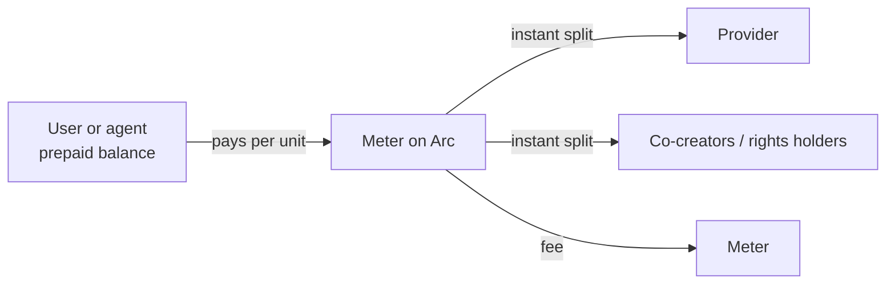

# Meter — Product Thesis

2026-09-19 · @Someone

## Summary

Meter is one prepaid balance that pays for anything priced per unit, down to a fraction of a cent, whether the payer is a person or an AI agent. It replaces subscriptions, bundles and ads, which exist mainly because card payments cannot settle small amounts profitably.

We start with AI tools priced per use for users in Nigeria, where most debit cards cannot pay foreign services at all. We then open the same balance to publishers, experts paid by the minute, and metered physical services. Every payment settles on Arc through Circle Nanopayments and x402.

## The problem

The internet sells in bundles because card payments cannot handle small amounts, and that model is now breaking.

- **Cards have a fee floor.** A fixed fee of roughly $0.30 per charge (approximate) makes anything under about $1 uneconomic. That is why content, software and AI are sold as monthly subscriptions or paid for with ads.
- **AI is breaking the ad model.** Google search traffic to publishers fell by about a third globally in the year to November, with US organic search referrals down 38% ([Reuters Institute via Foreign Policy Journal](https://www.foreignpolicyjournal.com/2026/09/15/publishers-find-alternative-monetization-sources-as-traffic-and-ad-revenues-decline/)). Small publishers lost 60% of Google referral traffic and medium publishers 47% ([Chartbeat via 9to5Google](https://9to5google.com/2026/03/18/google-search-traffic-publishers-report/)).
- **Agents read without paying.** One vendor estimates AI agents are 30–50% of traffic to many content-heavy sites, and none of it loads an ad ([xpay](https://www.xpay.sh/blog/article/ai-killing-publisher-ad-revenue/)).
- **Most of the world cannot pay USD subscriptions.** Since recent FX limits, most Nigerian debit cards carry a $0 international limit ([Lint](https://www.lint.finance/blog/7065-how-to-pay-for-chatgpt-plus-in-nigeria-2026-the-card-that-works)). Users pay through virtual dollar cards, which work for fixed subscriptions but not for usage billing.

### Problems Meter solves, by who has them

| Who | Problem today | What Meter changes |
| --- | --- | --- |
| Everyday users in prepaid markets | Must buy a USD subscription for each tool, often blocked by card limits; pay for months they barely use; forget to cancel | Top up once in naira or USDC, pay only for what they use, set a daily cap, nothing recurring to cancel |
| AI and software providers | Cannot sell small units profitably; lose users who won't subscribe; usage billing fails on declined cards | Charge per answer, export or call, and get paid the moment it is used |
| Publishers and creators | Search traffic and ad revenue are collapsing; AI agents read without paying; collaborators wait months for their share | Earn per read, play or minute from people and agents; each contributor's share is split at the moment of payment |
| Tutors, doctors, lawyers and consultants | Prepayment arguments, refunds, no-shows and chasing invoices | Paid per minute while the session runs; payment stops when it ends |
| Operators of metered physical services | Cash handling, the "no change" problem, leakage and manual collection | Paid per kWh, litre, minute or cycle, settled instantly with no cash |
| People sharing a resource, such as compound power or a borehole | One person pays, others use it; arguments over splitting the bill | Each person pays for exactly what they use |
| Developers running AI agents | Agents cannot hold cards or bank accounts; card billing needs a human to approve | Agents get scoped budgets and pay per call through x402 |
| Connected devices | No way to sell a single reading or buy a single charge | Devices pay each other per unit |

## Why it needs programmable settlement

Two conditions make Meter necessary rather than merely convenient.

| Test | How Meter passes |
| --- | --- |
| Is the pain enforced by law or market structure, not just inconvenience? | Yes. The card fee floor is built into how card networks price, and Nigeria's $0 international card limits come from FX policy. Neither is a user-experience problem a better app can fix. |
| Does it genuinely need programmable settlement? | Yes. Settling ₦5 for one answer, or a tenth of a cent per paragraph, needs fees near zero. Arc Nanopayments can go as low as $0.000001 per transaction ([cryptonews.net](https://cryptonews.net/news/finance/32941905/)). No card, bank or mobile-money rail settles amounts that small, and each payment can be split between several rights holders at the moment it happens. |

## The product

Meter has three sides that share one payment system.

- **Users** top up once, in naira or USDC, and set a daily spending limit. They pay only for what they use, with no subscriptions or ads. A passkey wallet means no seed phrase, and gas is covered by Meter.
- **Providers** add a few lines of code or an API gateway. They set a price per unit (per answer, article, minute or kWh) and are paid as each unit is used, split automatically between all rights holders.
- **AI agents** hit the same endpoints and pay per call through x402, using a scoped key with a budget and an allowlist. One integration earns a provider money from humans and machines.

Each unit used triggers a payment on Arc that settles in under a second and is split at once.

## What Meter can meter

Anything sold as a subscription, bundle or deposit only because small card charges don't pay can be sold per unit instead.

| Category | Examples | Unit priced |
| --- | --- | --- |
| Digital services | AI answers, images, voice and video generation; one-off software use such as a design export or PDF conversion; music, video, games and live streams; cloud storage and APIs | Per answer, per export, per song, per minute, per GB, per call |
| People's time | Tutors, doctors, lawyers and consultants; live creators | Per minute, stopping when the call ends |
| Physical metered services | Shared solar or generator power in a compound; borehole water; parking; EV charging; bike and scooter hire; laundry machines | Per kWh, per litre, per minute, per cycle |
| Machines and agents | AI agents buying data, tools and compute; devices paying other devices, such as a sensor selling readings | Per call, per reading |

In Nigeria, many of the physical services still run on cash, the "no change" problem, or trusting one person to split a shared bill fairly.

## Wedge and expansion path

We launch with AI tools priced per use, because it avoids the two-sided cold start that sank earlier micropayment products.

- **Demand already exists.** People use AI tools daily, and most Nigerian cards cannot pay for them.
- **We control the supply on day one.** Meter connects to AI model and tool APIs itself, so users get value before any provider signs up.
- **High frequency.** Daily AI use keeps the balance active, which the later categories inherit.

Once users hold balances, each new category adds paying users to the ones already there.

| Stage | Category | Why it comes next |
| --- | --- | --- |
| 1 | AI tools per use | Proven card pain, supply Meter controls, daily use |
| 2 | Publishers and creators | Losing search traffic fast; one integration also charges AI agents |
| 3 | Experts by the minute | Tutors, doctors and lawyers; ends prepayment and refund disputes |
| 4 | Metered physical services | Shared power, water, parking and charging; replaces cash and shared-bill arguments |
| 5 | Machines and agents | Agents and devices paying each other through x402 |

## Why now

Earlier micropayment products such as Coil, Blendle and Brave's token stalled for three reasons, and all three have changed.

| Why they stalled | What changed |
| --- | --- |
| Wallets were hard to set up | Passkey wallets need no seed phrase, and Paymaster removes gas fees for users |
| Settlement cost too much | Nanopayments on Arc bring fees near zero, with sub-second settlement in USDC |
| Providers had no urgent reason to switch | Search referrals are collapsing and agents read without paying, so providers need new revenue now |

Arc's public mainnet launched on September 16, 2026 ([Circle](https://www.circle.com/pressroom/circle-launches-arc-mainnet-an-economic-operating-system-for-the-internet)), so Meter can run on production rails from the start.

## Why Arc

Meter uses Circle's stack for every part of the payment flow.

| Circle product | Role in Meter |
| --- | --- |
| Nanopayments | Settles per-unit charges at near-zero fees |
| x402 | Lets AI agents pay providers per call; Circle's [nanopayments sample app](https://docs.arc.io/arc/references/sample-applications) shows the pattern |
| Wallets (modular, passkey) | User balances without seed phrases |
| Paymaster | Covers gas so users never see it |
| Gateway | Accepts USDC top-ups from any supported chain |
| USDC on Arc | The settlement asset, also used as gas |

For naira top-ups, cNGN is already deployed on Arc testnet ([TechCabal](https://techcabal.com/2025/12/12/wrappedcbdc-is-building-a-rail-to-move-naira-faster/)).

## Business model

Meter earns a small take on every unit that flows through it. The rates below are proposals to test, not yet validated.

- **AI tools (stage 1):** a margin between Meter's wholesale API cost and the per-use retail price.
- **Providers (stages 2–5):** a percentage fee on each payment settled, such as 5–10%, well below what app stores and subscription platforms take.
- **Top-ups:** a small spread on naira-to-USDC conversion through a licensed partner.

Prepaid balances also mean users pay before they consume, so Meter never carries credit risk.

## Competition and edge

Others serve one side of this market; Meter serves people and agents on one payment system, starting in prepaid markets the others ignore.

| Alternative | What it does | Where Meter differs |
| --- | --- | --- |
| Cloudflare pay-per-crawl, TollBit, xpay | Charge AI crawlers for content | Agents only; Meter also charges human users per unit |
| Virtual dollar cards (Grey, Payora, others) | Let Nigerians pay USD subscriptions | Still subscription-based; poor fit for usage billing |
| Regional plans such as ChatGPT Go in naira | One provider priced locally | Covers one tool; Meter covers many through one balance |
| Earlier micropayment products (Coil, Blendle) | Per-article payments | Stalled on wallet friction and settlement cost, both now solved |

## Founder-market fit

Hamid Adewuyi is a solo technical founder who has built consumer apps at scale, payment infrastructure, and on-chain systems.

- **Consumer scale:** technical lead at MTN Nigeria since January 2025, working on the MyMTN and MyCity apps. Daily exposure to how prepaid users top up and spend in small amounts.
- **Payments:** senior fullstack engineer at Enyata (2023–2025), building a government disbursement platform and fintech products.
- **Blockchain:** fullstack blockchain developer at the Africa Blockchain Center in Nairobi (2020–2022).
- **Stack:** Node.js/NestJS, Go, PostgreSQL, React Native, Docker and RabbitMQ, enough to build the whole of Meter's first version alone.

Africa adopted mobile through prepaid airtime rather than contracts. Meter applies the same model to the internet, and the founder knows that model from the inside.

## Roadmap

Meter ships in six phases, each adding a new kind of payer or provider to the same balance. Targets are working goals, to be revised as real usage data comes in.

| Phase | What ships | Goal |
| --- | --- | --- |
| 1. Launch | Per-use AI tools in Nigeria; passkey wallet; naira and USDC top-ups; daily spend limits | 200 paying users; 10+ paid uses per active user per week |
| 2. Agents | Scoped agent keys with budgets; per-call payments through x402 | 3+ developer teams running agents on Meter |
| 3. Providers | Provider SDK with automatic revenue splits; first publishers and tools | First outside providers earning from people and agents |
| 4. People's time | Per-minute billing for tutors, doctors, lawyers and consultants | First experts paid per minute |
| 5. Physical services | Metering for shared compound power, borehole water, parking and charging | First pilot site live |
| 6. New markets | Launch in other prepaid-first markets | Second country live |

## Risks and kill criteria

The biggest risks are user demand for per-use pricing and regulation of stored balances.

| Risk | Mitigation |
| --- | --- |
| Users prefer a flat subscription to per-use pricing | Daily spend caps and clear per-unit prices; test in the first month after launch |
| Thin margins reselling AI API usage | Expand quickly to provider fees in stages 2–5 |
| Holding balances may count as stored value or e-money | Structure balances as prepaid service credits; get legal sign-off early |
| Nigeria's SEC has proposed that consumers cannot hold foreign-pegged stablecoins without approval ([Mariblock](https://www.mariblock.com/stories/nigerias-sec-proposes-stricter-rules-for-digital-asset-firms)) | Users hold naira-denominated credits or cNGN; USDC stays in Meter's settlement layer |
| Two-sided cold start for providers | Stage 1 uses supply Meter controls, so no provider is needed at launch |
| Larger players add human per-use payments | Move first in prepaid markets they ignore |

**Kill criteria**

- [ ] Fewer than 10 paid uses per funded user per week after 30 days
- [ ] Fewer than 100 paying users within 90 days of launch

## Sources

- [Circle: Arc mainnet launch](https://www.circle.com/pressroom/circle-launches-arc-mainnet-an-economic-operating-system-for-the-internet)
- [Arc docs: sample applications](https://docs.arc.io/arc/references/sample-applications)
- [cryptonews.net: Nanopayments fees](https://cryptonews.net/news/finance/32941905/)
- [Foreign Policy Journal: publisher traffic decline](https://www.foreignpolicyjournal.com/2026/09/15/publishers-find-alternative-monetization-sources-as-traffic-and-ad-revenues-decline/)
- [9to5Google: Chartbeat referral data](https://9to5google.com/2026/03/18/google-search-traffic-publishers-report/)
- [xpay: AI agent traffic estimate](https://www.xpay.sh/blog/article/ai-killing-publisher-ad-revenue/)
- [Lint: Nigerian card limits](https://www.lint.finance/blog/7065-how-to-pay-for-chatgpt-plus-in-nigeria-2026-the-card-that-works)
- [TechCabal: cNGN on Arc testnet](https://techcabal.com/2025/12/12/wrappedcbdc-is-building-a-rail-to-move-naira-faster/)
- [Mariblock: SEC draft stablecoin rules](https://www.mariblock.com/stories/nigerias-sec-proposes-stricter-rules-for-digital-asset-firms)
